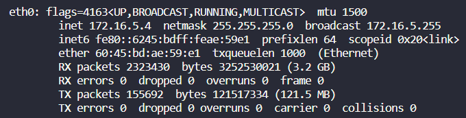
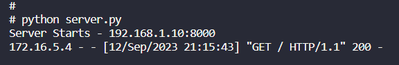
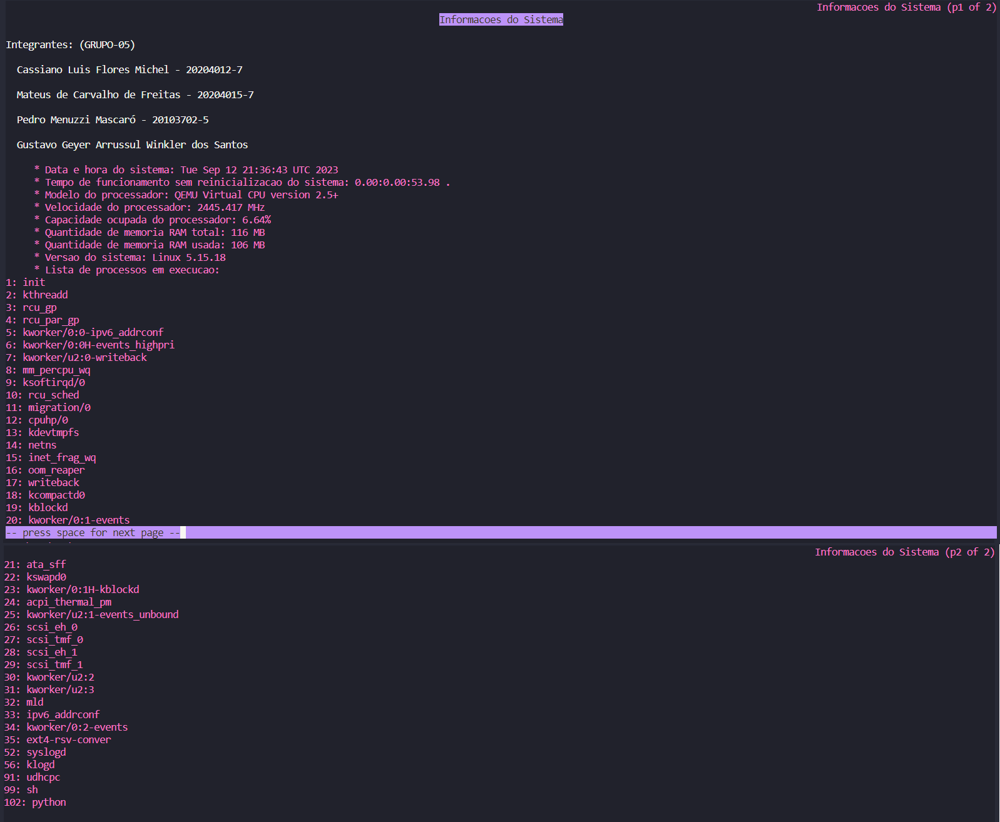

# Tutorial de Execução do Trabalho 1  

Cassiano Luis Flores Michel - 20204012-7  
Mateus de Carvalho de Freitas - 20204015-7  
Pedro Menuzzi Mascaró - 20103702-5  
Gustavo Geyer Arrussul Winkler dos Santos - 19102825-7  

Para executar o trabalho precisamos seguir os seguintes passos:  

-   [Configurações Iniciais](#configurações-iniciais)
-   [Configurações de IP](#configurações-de-ip)
-   [Configurações do Python](#configurações-de-python)
-   [Adicionar o código do servidor HTTP](#adicionar-o-codigo-do-servidor-http)
-   [Subir o servidor HTTP](#subir-o-servidor-http)

## Configurações Iniciais  

Inicialmente, devemos concluir todas as etapas de configuração do buildroot disponíveis nos tutoriais 1.1, 1.2 e 1.3 para seguir este tutorial.

## Configurações de IP  

Para iniciar o servidor HTTP, devemos estabelecer a conexão entre o host e o guest. Para isso, devemos modificar um script `S41network-config` encontrado na diretório `custom_scripts`. Devemos alterar o campo `<IP_DO_HOST>` para o IP da máquina na qual está hospedando o buildroot. Para visualizar o IP da máquina host (como também na máquina guest), devemos executar o comando `ifconfig`.



A linha `inet`, informa o IP que deve ser substituído pela label `<IP_DO_HOST>` apresentado no trecho de código a seguir.

```
#!/bin/sh
#
# Configuring host communication.
#

case "$1" in
 start)
	printf "Configuring host communication."

	/sbin/ifconfig eth0 192.168.1.10 up
	/sbin/route add -host <IP_DO_HOST> dev eth0
	/sbin/route add default gw <IP_DO_HOST>
	[ $? = 0 ] && echo "OK" || echo "FAIL"
	;;
 stop)
	printf "Shutdown host communication. "
	/sbin/route del default
	/sbin/ifdown -a
	[ $? = 0 ] && echo "OK" || echo "FAIL"
	;;
 restart|reload)
	"$0" stop
	"$0" start
	;;
 *)
	echo "Usage: $0 {start|stop|restart}"
	exit 1
esac

exit $?
```

Para que as modificações sejam aplicadas, será necessário recompilar a máquina guest. Para isso, execute o comando `make`.

Após a execução do comando `make`, iremos executar o sistema para testar se a conexão foi estabelecida com sucesso. Para isso, execute a emulação da máquina guest com o seguinte comando:

```
sudo qemu-system-i386 --device e1000,netdev=eth0,mac=aa:bb:cc:dd:ee:ff \
	--netdev tap,id=eth0,script=custom-scripts/qemu-ifup \
	--kernel output/images/bzImage \
	--hda output/images/rootfs.ext2 \
	--nographic \
	--append "console=ttyS0 root=/dev/sda"
```

Dentro da máquina guest, teste a conexão com o host utilizando o comando `ping`, com alvo no IP da máquina host.

Caso o ping seja efetuado com sucesso, podemos iniciar a configuração do ambiente pyhton que irá terá o servidor HTTP.

## Configurações do Python  

Antes de executarmos qualquer código python, será necessário executar o comando `make menuconfig` para entrar nas configurações do buildroot e preparar o interpretador python.

**ALERTA:** Antes de fechar o menu de configurações, não esqueça de salvar as alterações.

```
-- Target Packeges
    -- Interpreter languages and scripting
      [*] python3
```

Em seguida, devemos também configurar o WCHAR, utilizando a seguinte configuração. Novamente iremos executar `make menuconfig`:

```
 -- Toolchain
    C library (uClibc-ng) -->
    .
    .
    .
    [*] Enable WCHAR support
```

Após concluirmos as etapas anteriores, a modificação na toolchain irá exigir a recompilação de toda a distribuição, então é necessário executar o comando `make clean` e após `make` para que as alterações sejam aplicadas com sucesso.

**OBSERVAÇÃO:** Ao executar o comando `make clean`, verifique se todas as configurações feitas nos passos anteriores mantiveram configuradas.

## Adicionar o código do servidor HTTP  

Agora que já preparamos todo ambiente para montar nosso servidor, iremos desenvolver e executar o código abaixo, o qual é responsável por hospedar nosso servidor HTTP, e também montar uma página HTML com informações básicas da máquina guest.

```python
import os
import sys
import time
import socket
from http.server import BaseHTTPRequestHandler,HTTPServer

HOST_NAME = '192.168.1.10' # !!!REMEMBER TO CHANGE THIS!!!
PORT_NUMBER = 8000

def get_time():
    return os.popen("date").read()

def get_uptime():
    with open('/proc/uptime', 'r') as f:
        uptime_seconds = float(f.readline().split()[0])
        return uptime_seconds

def get_cpu_info():
    with open('/proc/cpuinfo', 'r') as f:
        cpuinfo = f.readlines()

    model_name = [line.split(':')[-1].strip() for line in cpuinfo if 'model name' in line][0]
    mhz = [line.split(':')[-1].strip() for line in cpuinfo if 'cpu MHz' in line][0]
    return model_name, mhz

def get_cpu_percent():
    with open('/proc/stat', 'r') as f:
        fields = [float(field) for field in f.readline().strip().split()[1:]]
        idle_time = fields[3]
        total_time = sum(fields)
        return (1.0 - idle_time / total_time) * 100.0

def get_mem_info():
    with open('/proc/meminfo', 'r') as f:
        meminfo = f.readlines()

    total_memory = int([line.split(':')[-1].strip() for line in meminfo if 'MemTotal' in line][0].split()[0]) // 1024

    free = int([line.split(':')[-1].strip() for line in meminfo if 'MemFree' in line][0].split()[0])

    buffers = int([line.split(':')[-1].strip() for line in meminfo if 'Buffers' in line][0].split()[0])

    cached = int([line.split(':')[-1].strip() for line in meminfo if 'Cached' in line][0].split()[0])

    used_memory =   ((total_memory - free - buffers - cached) // 1024) * -1

    return total_memory, used_memory

def get_processes():
    processes = []
    for pid in os.listdir('/proc'):
        try:
            pid = int(pid)
            with open(os.path.join('/proc', str(pid), 'stat'), 'rb') as f:
                cmdline = f.read().decode().split(" ")
                if cmdline:
                    processes.append({'pid': cmdline[0], 'name': cmdline[1].strip("()")})
        except (ValueError, FileNotFoundError):
            pass
    return processes

def get_system_info():
    hostname = socket.gethostname()
    os_name = os.uname().sysname
    os_version = os.uname().release

    return hostname, os_name, os_version

def format_time(seconds):
    m, s = divmod(seconds, 60)
    h, m = divmod(m, 60)
    return f"{h:.2f}:{m:.2f}:{s:.2f} ."

def format_processes(processes):
    return '\n'.join([f"{p['pid']}: {p['name']}" for p in processes])

def generate_html():
    uptime = get_uptime()
    cpu_model, cpu_mhz = get_cpu_info()
    cpu_percent = get_cpu_percent()
    total_memory, used_memory = get_mem_info()
    processes = get_processes()
    hostname, os_name, os_version = get_system_info()

    html = f"""
    <html>
        <head>
            <title>Informacoes do Sistema</title>
            <meta charset="UTF-8">
        </head>
        <body>
            <h1>Informacoes do Sistema</h1>
            <h2>Integrantes: (GRUPO-05)</h2>
            <h3>Cassiano Luis Flores Michel - 20204012-7</h3>
            <h3>Mateus de Carvalho de Freitas - 20204015-7</h3>
            <h3>Pedro Menuzzi Mascaró - 20103702-5</h3>
            <h3>Gustavo Geyer Arrussul Winkler dos Santos - 19102825-7</h3>
            <ul>
                <li>Data e hora do sistema: {get_time()}</li>
                <li>Tempo de funcionamento sem reinicializacao do sistema: {format_time(uptime)}</li>
                <li>Modelo do processador: {cpu_model}</li>
                <li>Velocidade do processador: {cpu_mhz} MHz</li>
                <li>Capacidade ocupada do processador: {cpu_percent:.2f}%</li>
                <li>Quantidade de memoria RAM total: {total_memory} MB</li>
                <li>Quantidade de memoria RAM usada: {used_memory} MB</li>
                <li>Versao do sistema: {os_name} {os_version}</li>
                <li>Lista de processos em execucao: <pre>{format_processes(processes)}</pre></li>
            </ul>
        </body>
    </html>
    """
    return html

class MyHandler(BaseHTTPRequestHandler):
    def do_HEAD(s):
        s.send_response(200)
        s.send_header("Content-type", "text/html")
        s.end_headers()
    def do_GET(s):
        """Respond to a GET request."""
        s.send_response(200)
        s.send_header("Content-type", "text/html")
        s.end_headers()
        s.wfile.write(generate_html().encode())

if __name__ == '__main__':
    httpd = HTTPServer((HOST_NAME, PORT_NUMBER), MyHandler)
    print("Server Starts - %s:%s" % (HOST_NAME, PORT_NUMBER))
    try:
        httpd.serve_forever()
    except KeyboardInterrupt:
        pass
    httpd.server_close()
    print("Server Stops - %s:%s" % (HOST_NAME, PORT_NUMBER))
```

Para editar códigos na máquina guest, devemos utilizar o editor de texto `vi`, com o comando `vi <NOME_DO_ARQUIVO>.py`.

## Subir o servidor HTTP  

Em seguida, após salvarmos o código, iremos executá-lo utilizando o comando `python <NOME_DO_ARQUIVO>.py`.

Devemos então obter um resultado semelhante ao print abaixo.



Com isso, temos certeza de que o servidor foi inciado com êxito, e poderá ser acessado via navegador na máquina host.

Para acessar a página HTML, devemos informar o IP da máquina guest na aba de pesquisa do navegador junto com a porta utilizada pelo servidor HTTP do buildroot, como demonstra a imagem abaixo.



Ao fim deste tutorial, deve ser possível visualizar a página HTML hospedada pelo buildroot através do servidor HTTP que criamos com script o python. Também, deve ser possível visualizar diversas informações importantes do sistema como a lista de processos ativos na máquina guest.
